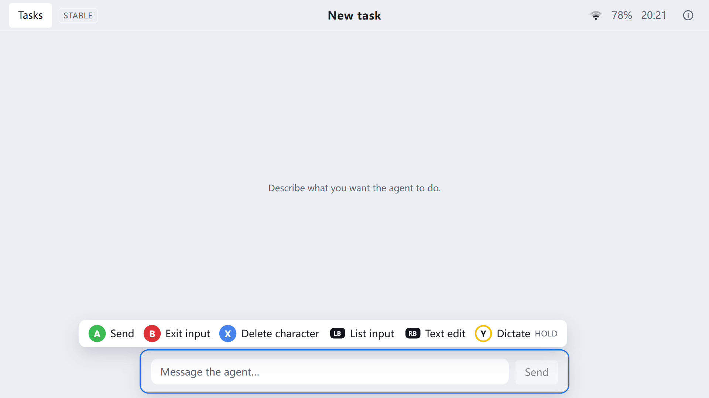
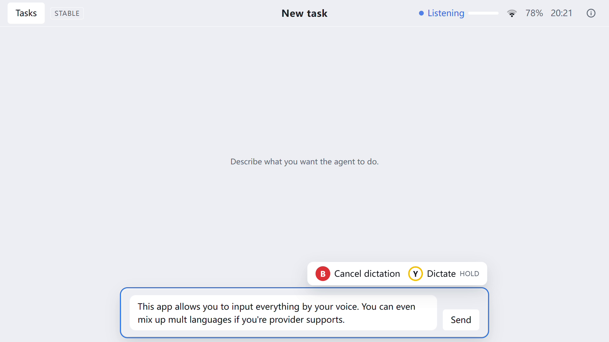
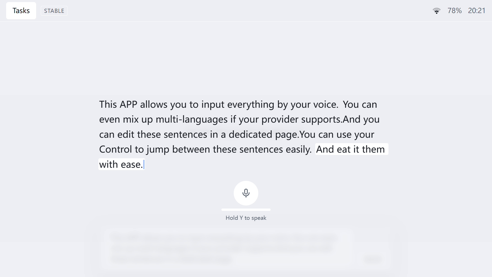
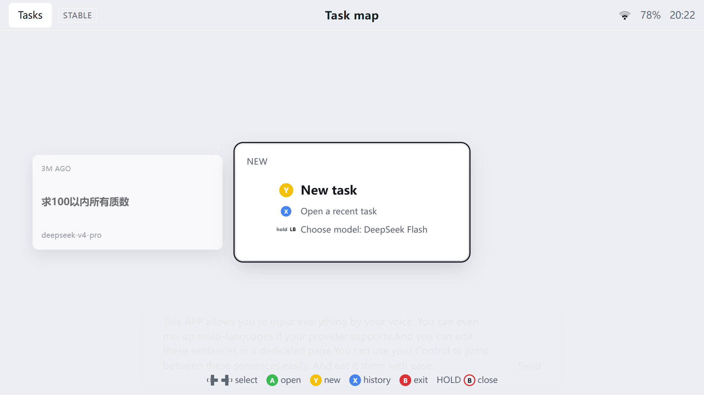
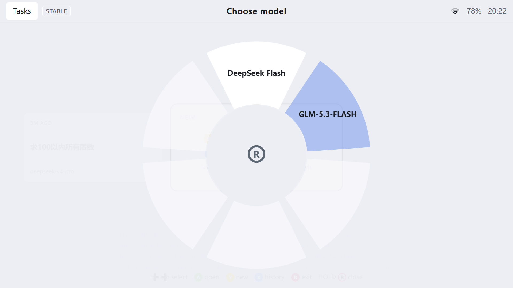
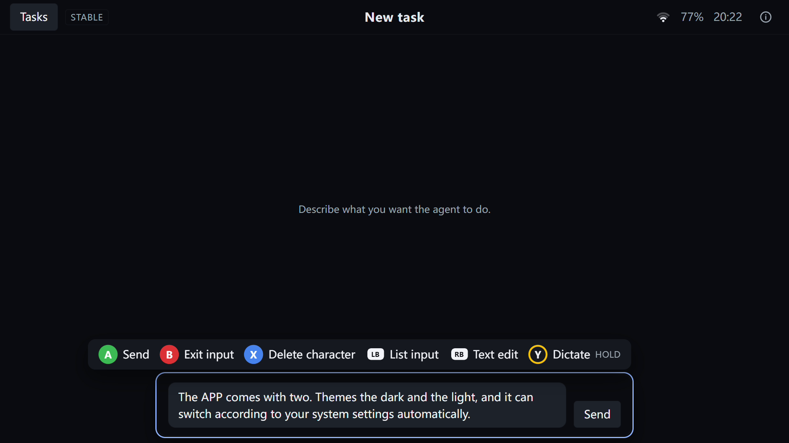
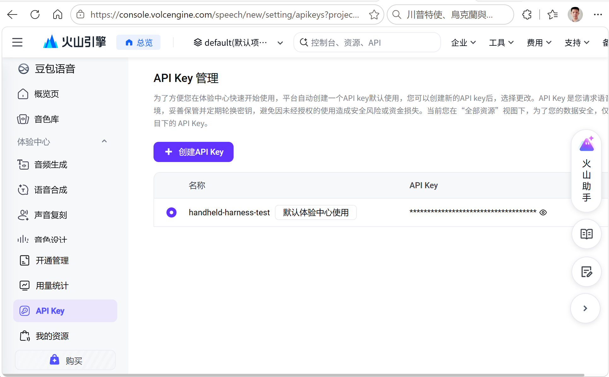
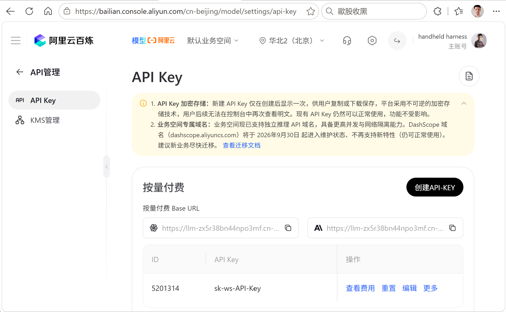

<p align="center">
  
</p>

<h1 align="center">Handheld Harness</h1>

<p align="center">
  <b>Drive an AI coding agent from your gamepad — on a handheld gaming PC, or from the couch.</b>
</p>

<p align="center">
  <a href="LICENSE"></a>
  
  
  
</p>

<p align="center">
  <b>English</b> · <a href="README.zh-CN.md">简体中文</a>
</p>

---

Handheld Harness is a controller-first desktop app for running **AI coding tasks** on a Windows 11 handheld. It is an Electron shell plus a React UI built on top of [OpenCode](https://opencode.ai/docs/): every step of a session — start a task, dictate the prompt, watch the agent work, reword a sentence, switch tasks and choose a model — is designed for a gamepad instead of a mouse and keyboard. A keyboard still works, and the same controls are reachable with it.

**Contents**

- [Features](#features)
- [Getting started](#getting-started)
- [OpenCode is the base](#opencode-is-the-base)
- [Voice input](#voice-input)
- [Development](#development)
- [License](#license)

## Features

<table>
  <tr>
    <td width="50%">
      
      <br /><b>Every action lives on the controller</b><br />
      A context-aware hint bar spells out which face, shoulder or trigger button does what — send, delete, list commands, edit text or dictate.
    </td>
    <td width="50%">
      
      <br /><b>Talk instead of typing</b><br />
      Hold <b>Y</b> (or <kbd>Ctrl</kbd>+<kbd>D</kbd>) and speak. The transcript streams live into the input, and mixed Chinese and English speech is supported.
    </td>
  </tr>
  <tr>
    <td width="50%">
      
      <br /><b>Fix your dictation with ease</b><br />
      A dedicated text-edit screen lets you jump between sentences with the sticks or the D-pad and re-dictate into any one of them.
    </td>
    <td width="50%">
      
      <br /><b>Switch between tasks with the controller</b><br />
      The task map is a carousel of open sessions — create, open, browse recent or close a task without leaving the pad.
    </td>
  </tr>
  <tr>
    <td width="50%">
      
      <br /><b>Choose a model like a weapon wheel</b><br />
      Hold <b>LB</b> on a new task card to open the radial model ring, tilt the stick onto a model and release to apply it.
    </td>
    <td width="50%">
      
      <br /><b>Light and dark themes</b><br />
      Ships with light and dark themes and follows the system preference automatically. The UI language (English / 简体中文) is switchable in the system menu.
    </td>
  </tr>
</table>

Also included:

- **System menu** — model management, voice input, display, and about &amp; diagnostics, all reachable with the <b>Start</b> button.
- **Session info** — message count, token usage, context percentage, cost, working directory and thinking effort for the current task.
- **English and simplified Chinese UI**, switchable at runtime.
- **Optional auto-update** in the installed build, driven by GitHub Releases.

## Getting started

Requires **Windows 11** and **Node.js 24** (see [`.nvmrc`](.nvmrc)). A gamepad is optional — the app is fully usable with a keyboard.

```powershell
git clone https://github.com/limitMe/handheld-harness.git
cd handheld-harness
npm install
npm run dev
```

`npm install` also pulls the matching OpenCode platform binary through the pinned `opencode-ai` dependency, so you do not have to install it separately.

Other common commands:

```powershell
npm run build   # bundle to out/
npm run start   # run the built bundle
npm run dist    # package a Windows NSIS installer into dist/
```

## OpenCode is the base

Handheld Harness does not ship its own models. It starts and drives a local [OpenCode](https://opencode.ai/docs/) server (pinned to `1.18.34`) and turns its HTTP/SSE API into the app's own session model. Everything about the agent — providers, models, tools, permissions — comes from OpenCode.

Before the first run, configure **at least one model provider** with the OpenCode CLI:

```powershell
npm install -g opencode-ai@1.18.34   # same version as the project
opencode auth login                   # pick a provider and paste its API key
```

The System menu only lists providers that OpenCode has authenticated, so a fresh install shows an empty model list until this is done.

If you prefer a GUI, tools such as **[CC Switch](https://github.com/farion1231/cc-switch)** can manage providers for OpenCode (and Claude Code / Codex). See the [OpenCode docs](https://opencode.ai/docs/) for the full list of supported providers.

## Voice input

Dictation is provider-agnostic and configured entirely inside the app under **System menu › Voice input**. Pick a provider (default is **None**), paste its API key and choose a model. API keys are encrypted with the OS keychain (Electron `safeStorage`) in a per-profile file — they are never written into the repository or the plain settings file.

- **Doubao (Volcengine / 火山引擎)** — real-time Seed-ASR streaming. Create an API key in the [Volcengine console](https://console.volcengine.com/speech/new/setting/apikeys), then choose a model/billing tier (Resource-Id) in the app.

  

- **Fun-ASR (Alibaba Cloud Bailian / 阿里云百炼)** — DashScope real-time ASR. Create an API key on the [Bailian API Key page](https://bailian.console.aliyun.com/cn-beijing/model/settings/api-key) and paste it into the app.

  

- **OpenAI** — real-time transcription. Create a key on the [OpenAI API Keys page](https://platform.openai.com/api-keys), paste it into the app and choose a transcription model (`gpt-live-transcribe` by default).

Once a provider is configured, hold **Y** while an input is focused to dictate (keyboards can use <kbd>Ctrl</kbd>+<kbd>D</kbd>). With no provider, dictation stays unavailable but Windows dictation (<kbd>Win</kbd>+<kbd>H</kbd>) still works.

## Development

Requirements and self-checks live in [`AGENTS.md`](AGENTS.md); requirements come from the specs under [`docs/specs/`](docs/specs/README.md).

**Layout**

```
src/
  shared/     # pure TS shared by main and renderer: IPC contract, zod schemas, settings
  main/       # system capabilities, networking, the agent engine, IPC, settings, logging
  preload/    # contextBridge; exposes only window.handheld
  renderer/   # UI only (React)
tests/
  unit/       # Vitest
  e2e/        # Playwright smoke tests
```

**Conventions**

- Windows first: scripts run in Windows 11 PowerShell 7 and are written in Node, not bash; paths always go through `node:path`.
- The renderer never touches the network or Node directly — everything goes through validated IPC to the main process.
- The renderer is UI only; third-party UI components are used solely through `src/renderer/src/ui/`, and styling goes through semantic design tokens in `src/renderer/src/styles/`.
- Dependencies are pinned to exact versions and upgraded in a separate commit.

**npm scripts**

| Command | Purpose |
|---|---|
| `npm run dev` | electron-vite dev mode; renderer uses HMR, main/preload restart Electron |
| `npm run build` | Build to `out/` |
| `npm run start` | Run the built output (electron-vite preview) |
| `npm run dist` | Build and package a Windows NSIS installer into `dist/` |
| `npm run dist:publish` | Build, package and publish a GitHub Release |
| `npm run release:verify` | Check the published GitHub Release carries the three update assets |
| `npm run typecheck` | Type-check the main / preload / renderer tsconfigs |
| `npm run lint` | ESLint with zero warnings |
| `npm run format` | Prettier write-back |
| `npm test` | Vitest unit tests |
| `npm run test:e2e` | Build, then run Playwright `_electron` smoke tests |
| `npm run check` | Run typecheck, lint and tests in sequence — the required self-check |
| `npm run clean` | Remove `out/` and e2e screenshot artifacts |
| `npm run icons` | Regenerate the app icons from `resources/icons/source.png` |

The whole project is developed with itself (see [`docs/dogfooding.md`](docs/dogfooding.md)): the specs are the source of requirements, and the app is used to drive the AI agent that implements them.

## License

[MIT](LICENSE) © 2026 Handheld Harness
