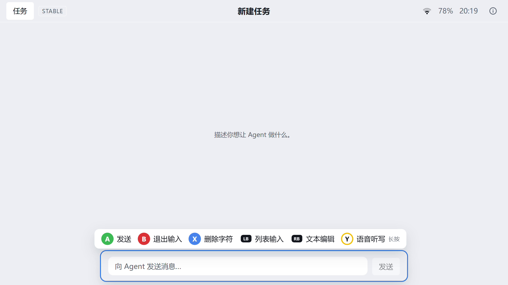
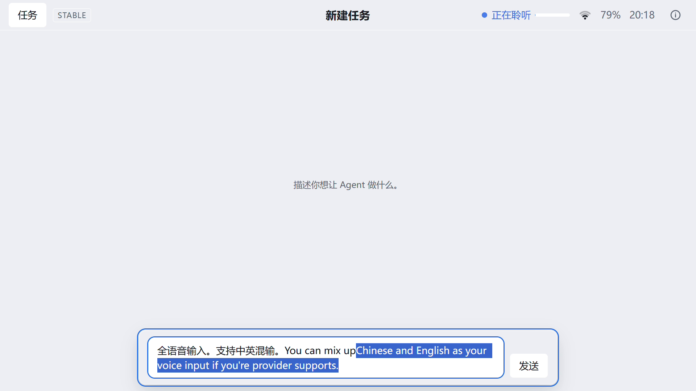
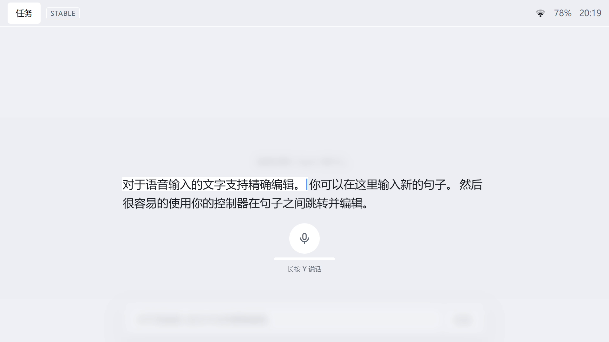
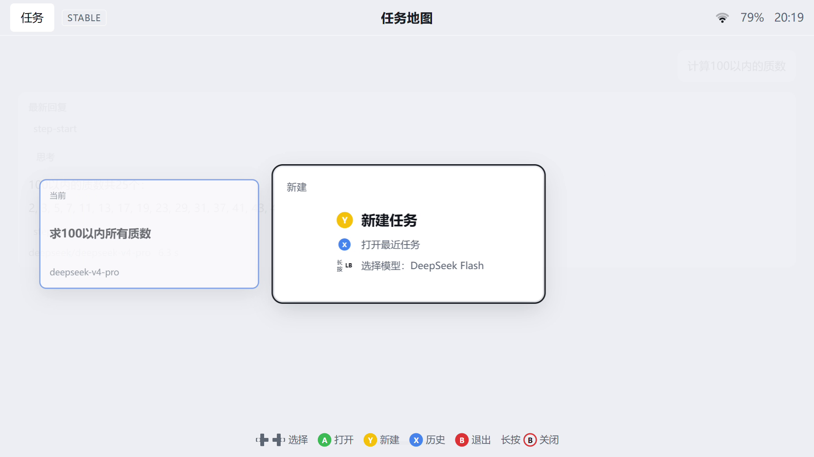
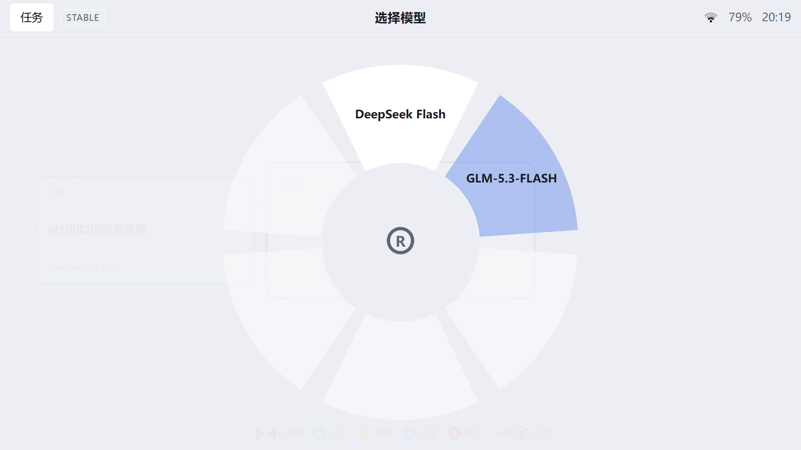
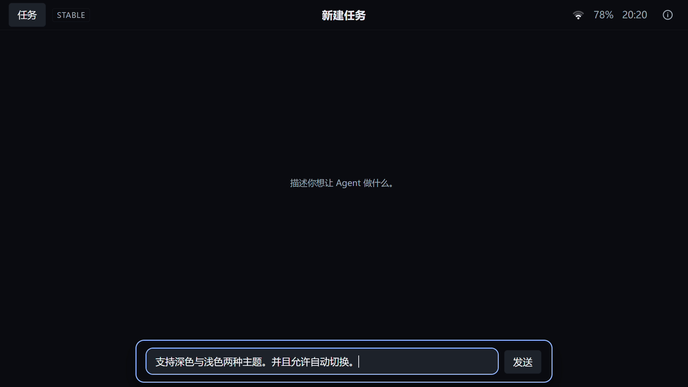

<p align="center">
  
</p>

<h1 align="center">Handheld Harness</h1>

<p align="center">
  <b>用手柄驱动 AI 编码 Agent —— 无论是掌机，还是客厅的沙发。</b>
</p>

<p align="center">
  <a href="LICENSE"></a>
  
  
  
</p>

<p align="center">
  <a href="README.md">English</a> · <b>简体中文</b>
</p>

---

Handheld Harness 是一个为手柄优先设计的桌面应用，在 Windows 11 掌机上运行 **AI 编码任务**。它是基于 [OpenCode](https://opencode.ai/docs/) 的 Electron 外壳 + React UI：一次会话的每个步骤——新建任务、口述提示词、观察 Agent 工作、修改某一句文字、切换任务、选择模型——都为手柄而设计，而不是鼠标键盘。键盘同样可用，上面的操作都可以用键盘完成。

**目录**

- [功能特性](#功能特性)
- [快速开始](#快速开始)
- [以 OpenCode 为底座](#以-opencode-为底座)
- [语音输入](#语音输入)
- [开发](#开发)
- [许可证](#许可证)

## 功能特性

<table>
  <tr>
    <td width="50%">
      
      <br /><b>所有操作都在手柄上</b><br />
      上下文相关的提示条会标明每个按键的作用——发送、删除、命令列表、文本编辑或听写。
    </td>
    <td width="50%">
      
      <br /><b>说出来，不用打字</b><br />
      长按 <b>Y</b>（或 <kbd>Ctrl</kbd>+<kbd>D</kbd>）开口说话，文字实时流入输入框，支持中英文混合识别。
    </td>
  </tr>
  <tr>
    <td width="50%">
      
      <br /><b>轻松修改听写结果</b><br />
      独立的文本编辑页，可用摇杆或方向键在句子间跳转，并对任意一句重新口述。
    </td>
    <td width="50%">
      
      <br /><b>用手柄切换多个任务</b><br />
      任务地图是打开会话的卡片轮播——新建、打开、浏览最近任务或关闭任务，全程不离开手柄。
    </td>
  </tr>
  <tr>
    <td width="50%">
      
      <br /><b>像武器轮盘一样选模型</b><br />
      在新建任务卡上长按 <b>LB</b> 打开环形模型轮盘，推动摇杆选中模型后松手即可应用。
    </td>
    <td width="50%">
      
      <br /><b>浅色与深色主题</b><br />
      内置浅色和深色主题，自动跟随系统偏好。界面语言（English / 简体中文）可在系统菜单中切换。
    </td>
  </tr>
</table>

此外还有：

- **系统菜单** —— 模型管理、语音输入、显示、关于与诊断，按 <b>Start</b> 键即可打开。
- **会话信息** —— 当前任务的消息数、Token 用量、上下文占比、费用、工作目录与思考强度。
- **英文与简体中文界面**，运行时即可切换。
- **可选自动更新**（安装版），由 GitHub Releases 驱动。

## 快速开始

需要 **Windows 11** 和 **Node.js 24**（见 [`.nvmrc`](.nvmrc)）。手柄是可选的——用键盘也能完整使用。

```powershell
git clone https://github.com/limitMe/handheld-harness.git
cd handheld-harness
npm install
npm run dev
```

`npm install` 会通过锁定的 `opencode-ai` 依赖一并拉取对应平台的 OpenCode 二进制，因此无需单独安装。

其它常用命令：

```powershell
npm run build   # 打包到 out/
npm run start   # 运行构建产物
npm run dist    # 打包 Windows NSIS 安装包到 dist/
```

## 以 OpenCode 为底座

Handheld Harness 本身不带模型。它会启动并驱动一个本地 [OpenCode](https://opencode.ai/docs/) server（锁定 `1.18.34`），并把它的 HTTP/SSE 接口转换成本应用自己的会话模型。Agent 的一切——服务商、模型、工具、权限——都来自 OpenCode。

首次运行前，先用 OpenCode CLI 配置**至少一个模型服务商**：

```powershell
npm install -g opencode-ai@1.18.34   # 与工程内锁定的版本一致
opencode auth login                   # 选择服务商并填入 API key
```

系统菜单只会列出 OpenCode 已认证的服务商，因此在完成这一步之前，模型列表是空的。

如果偏好图形界面，可以使用 **[CC Switch](https://github.com/farion1231/cc-switch)** 之类的工具管理 OpenCode（以及 Claude Code / Codex）的服务商。支持的服务商完整列表见 [OpenCode 文档](https://opencode.ai/docs/)。

## 语音输入

听写与具体服务商解耦，全部在应用内 **系统菜单 › 语音输入** 中配置：选择服务商（默认 **None**）、粘贴 API key、选择模型。API key 使用系统钥匙串（Electron `safeStorage`）加密保存在 profile 私有文件中——绝不会写进仓库或明文设置文件。

- **豆包（火山引擎）** —— 实时 Seed-ASR 流式识别。在[火山引擎控制台](https://console.volcengine.com/speech/new/setting/apikeys)创建 API key，然后在应用里选择模型 / 计费档位（Resource-Id）。

  

- **Fun-ASR（阿里云百炼）** —— DashScope 实时语音识别。在[百炼 API Key 页面](https://bailian.console.aliyun.com/cn-beijing/model/settings/api-key)创建 API key，粘贴到应用即可。

  

- **OpenAI** —— 实时转写。在 [OpenAI API Keys 页面](https://platform.openai.com/api-keys)创建 key，粘贴到应用中并选择转写模型（默认 `gpt-live-transcribe`）。

配置好服务商后，聚焦输入框时长按 **Y** 即可听写（键盘可用 <kbd>Ctrl</kbd>+<kbd>D</kbd>）。未配置服务商时听写不可用，但仍可使用 Windows 听写（<kbd>Win</kbd>+<kbd>H</kbd>）。

## 开发

运行要求与自检约定见 [`AGENTS.md`](AGENTS.md)；需求源头是 [`docs/specs/`](docs/specs/README.md) 下的规格文档。

**目录结构**

```
src/
  shared/     # 主进程与渲染进程共用的纯 TS：IPC 契约、zod schema、设置类型
  main/       # 系统能力、网络、Agent 引擎、IPC、设置、日志
  preload/    # contextBridge，只暴露 window.handheld
  renderer/   # UI（React），只负责渲染
tests/
  unit/       # Vitest
  e2e/        # Playwright 冒烟测试
```

**约定**

- Windows 优先：脚本在 Windows 11 PowerShell 7 中运行，用 Node 编写而非 bash；路径一律通过 `node:path` 拼接。
- 渲染进程不直接访问网络或 Node——所有请求都经过校验后的 IPC 交给主进程。
- 渲染进程只负责 UI；第三方 UI 组件只能通过 `src/renderer/src/ui/` 使用，样式只走 `src/renderer/src/styles/` 下的语义 token。
- 依赖使用精确版本，升级单独提交。

**npm 指令**

| 命令 | 作用 |
|---|---|
| `npm run dev` | electron-vite 开发模式；渲染进程走 HMR，main / preload 改动会重启 Electron |
| `npm run build` | 构建到 `out/` |
| `npm run start` | 运行构建产物（electron-vite preview） |
| `npm run dist` | 构建并打包 Windows NSIS 安装包到 `dist/` |
| `npm run dist:publish` | 构建、打包并发布 GitHub Release |
| `npm run release:verify` | 核对已发布 GitHub Release 是否带齐三个更新资产 |
| `npm run typecheck` | 分别检查 main / preload / renderer 三个 tsconfig |
| `npm run lint` | ESLint，零 warning |
| `npm run format` | Prettier 写回 |
| `npm test` | Vitest 单元测试 |
| `npm run test:e2e` | 先构建，再跑 Playwright `_electron` 冒烟测试 |
| `npm run check` | 依次运行 typecheck、lint、test —— 完成任务前的统一自检 |
| `npm run clean` | 删除 `out/` 与 e2e 截图产物 |
| `npm run icons` | 从 `resources/icons/source.png` 重新生成应用图标 |

整个项目用它自己来开发（见 [`docs/dogfooding.md`](docs/dogfooding.md)）：规格文档是需求源头，而应用本身被用来驱动实现这些需求的 AI Agent。

## 许可证

[MIT](LICENSE) © 2026 Handheld Harness
